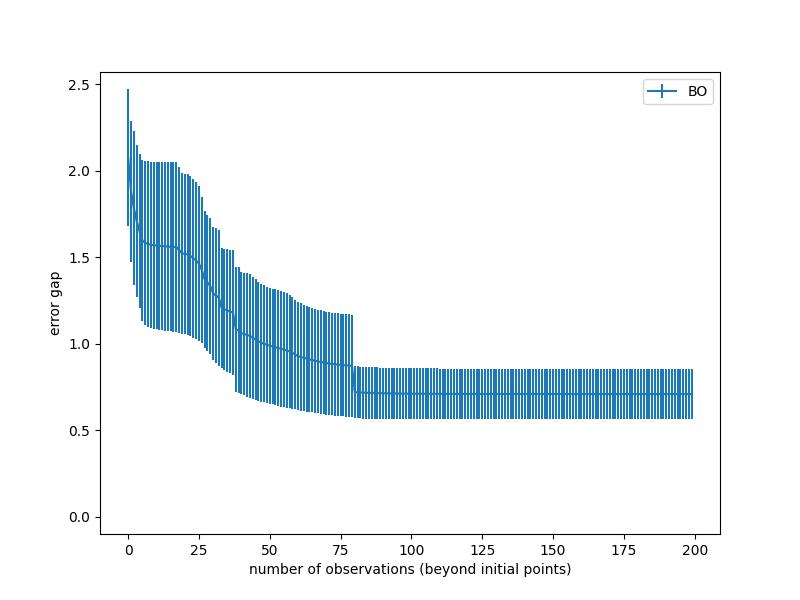

# Introduction<a name="introduction"></a>
This is a Gpytorch based Bayesian optimization project. ```acquisition.py``` contains the acquisition functions that need to be used, currently there is only one EI function. ```Bo.py```contains the Bayesian optimization trainer class, which can generate and train the specified Gaussian process regression model as well as train the Bayesian optimization process. ```GP.py``` are Gaussian process models, we currently only use the ExactGP model. ```Test_funtions.py``` contains test functions, here we only use the **Hartmann -6D function**. All of these classes and functions are reusable, maintainable and extensible.

## An example of how to run<a name="example"></a>
This example is in the ```test.py```.<br>
Before we start training, please run the following code first to configure the environment 
```python
pip install -r requirements.txt
```
First, we need to choose a function to optimize, the following code imports and selects the Hartmann -6D function
```python
from Test_functions import Hartmann6D

test_function = Hartmann6D()
```
Then we need to choose our GP model and Likelihood. 
```python
import gpytorch
import torch
model_name = "ExactGP"
noises = torch.ones(20) * 0.01
likelihood = gpytorch.likelihoods.FixedNoiseGaussianLikelihood(noise=noises, learn_additional_noise=True).cuda()
```
Here we do not instantiate the GP model because each iteration of the experiment creates a new model. To control the instantiation and prediction capabilities of GP models during BO training, we wrote a **ModelFactory** Class in ```GP.py.```<br>
<br>
The next step is to choose an appropriate acquisition function
```python
from acquisition import EI
acq = EI()
```
Finally, the training function of the BO trainer is used to optimize the test function.
```python
from Bo import BO_Trainer
trainer = BO_Trainer(test_function,  acq, likelihood, model_name)
trainer.train(test_function, 10, 200)
```
The whole running process code is as follows
```python
from Test_functions import Hartmann6D
from acquisition import EI
from Bo import BO_Trainer
import gpytorch
import torch

test_function = Hartmann6D()
model_name = "ExactGP"
acq = EI()
noises = torch.ones(20) * 0.01
likelihood = gpytorch.likelihoods.FixedNoiseGaussianLikelihood(noise=noises, learn_additional_noise=True).cuda()
trainer = BO_Trainer(test_function,  acq, likelihood, model_name)
trainer.train(test_function, 10, 200)
```

## Results<a name="result"></a>
The output of the above test code:<br>

